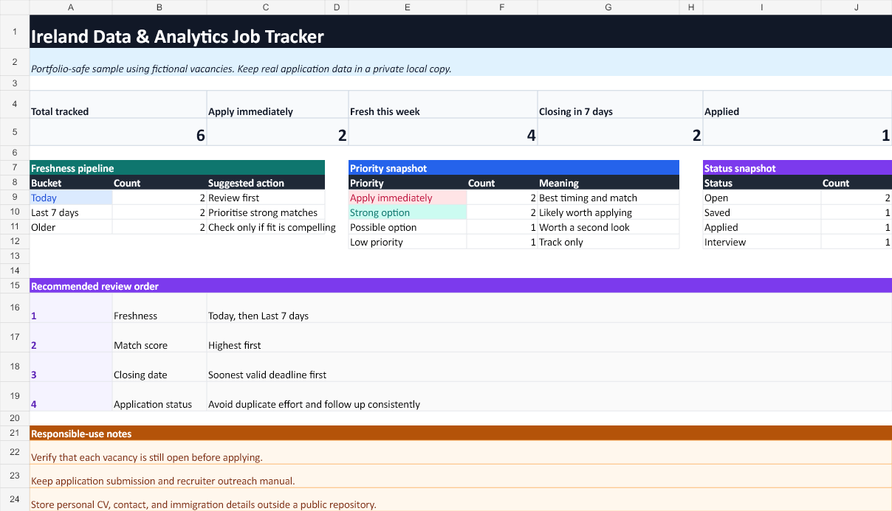

# Ireland Job Search Tracker

A spreadsheet-based workflow for organising and prioritising data and analytics vacancies in Ireland. It combines a structured research checklist with an Excel dashboard that tracks role freshness, deadlines, match scores, status, salary, work mode, and source links.



## Features

- Dashboard with application, freshness, deadline, priority, and status summaries
- Filterable tracker with formulas for age, freshness, and duplicate detection
- Consistent priority and status dropdowns
- Conditional formatting for urgent, strong-match, and duplicate records
- Fictional sample data suitable for a public portfolio
- Research-only guardrails: it does not submit applications or contact employers

## Repository contents

| Path | Purpose |
| --- | --- |
| examples/sample_jobs.csv | Fictional source rows used by the sample. |
| examples/Job_Search_Tracker_Sample.xlsx | Ready-to-open example workbook. |
| src/build-job-tracker.mjs | Rebuilds the workbook and preview assets. |
| src/validate-sample.mjs | Checks the public CSV for valid fields and portfolio-safety markers. |
| docs/workflow-template.md | Reusable vacancy research and validation workflow. |
| assets/dashboard.png | Portfolio preview of the workbook dashboard. |

## Try the project

Open [the sample workbook](examples/Job_Search_Tracker_Sample.xlsx) in Excel and explore the Dashboard, Tracker, and Lists sheets.

The builder uses the spreadsheet runtime bundled with Codex desktop. From a compatible Codex workspace, run:

    node src/build-job-tracker.mjs examples/Job_Search_Tracker_Sample.xlsx

The finished workbook and CSV remain usable without the builder runtime.

## Validate the public sample

The repository includes a dependency-free check for the fictional CSV used in the public workbook. It validates the required fields, controlled vocabularies, dates, URLs, duplicate keys, and fictional-data marker before a change is accepted.

```bash
npm run check
```

The same check runs in GitHub Actions. It is deliberately scoped to the public sample; keep real search history in a separate private, local workbook.

## Privacy

Real application history, CV paths, email addresses, immigration details, and recruiter/contact research are intentionally excluded. Keep personal data in a private local file and out of version control.

## Scope

This repository demonstrates the tracker design and workbook-generation workflow. Automated vacancy discovery and email delivery are not implemented here.

## Status

Portfolio project developed with Codex. The sample data and organisations are fictional.
